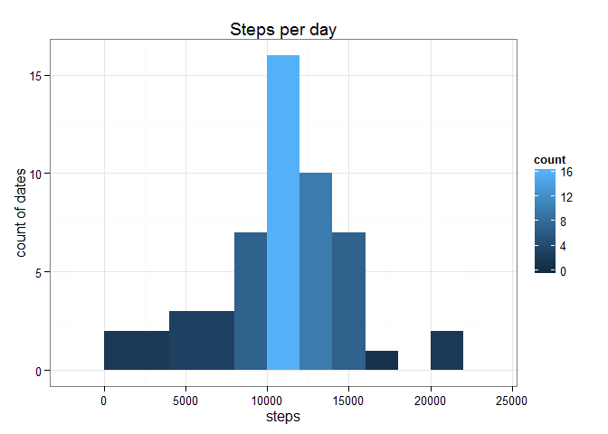
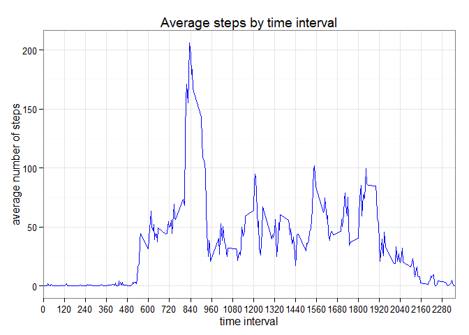
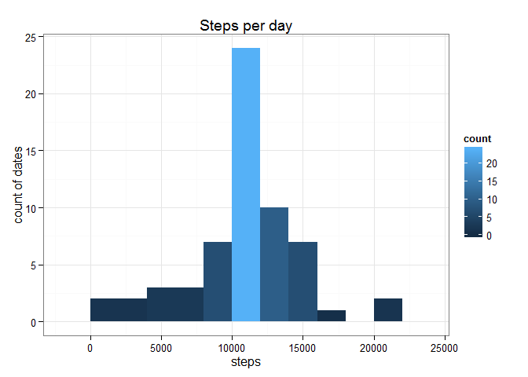
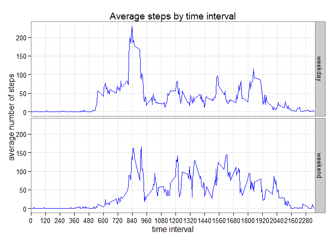

# Reproducible Research: Peer Assessment 1


## Loading and preprocessing the data

The following code loads non-default libraries that are used by the analysis and then loads the data file. 


```r
# Load necessary libraries.
library(ggplot2)
# Load the file.
activities <- read.csv("activity.csv")
```

## What is mean total number of steps taken per day?

The following code calculates the total number of steps taken per day, makes a histogram of the steps taken per day, and then calculates the mean and median of the total number of steps taken per day.


```r
# Split the data by date and sum the total of steps for each date.
df <- tapply(activities$steps, activities$date, sum)
df <- data.frame(df)
names(df) <- c('steps')

# Plot the histogram.
ggplot(df, aes(x=steps)) + geom_histogram(binwidth=2000, aes(fill = ..count..)) +
    theme_bw() +ylab("count of dates") + labs(title="Steps per day")
```

 

```r
# Calculate and report the mean and median total number of steps each day.
computedMean <- format(round(mean(df$steps, na.rm = TRUE)), big.mark=",", scientific=FALSE)
computedMedian <- format(round(median(df$steps, na.rm = TRUE)), big.mark=",", scientific=FALSE)
```

The mean number of steps taken per day is **10,766**. The median number of steps taken per day is **10,765**.


## What is the average daily activity pattern?

The following code groups the data by 5-minute intervals across all days for which data was measured, and then makes a time series plot of the intervals and the average number of steps taken across all days. 


```r
# Split the data by interval, and take the average of steps for each interval, excluding NA values.
df2 <- tapply(activities$steps, activities$interval, mean, na.rm = TRUE)
df2 <- data.frame(df2)
df2$interval <- rownames(df2)
rownames(df2) <- NULL
names(df2) <- c('steps', 'interval')
df2$interval <- as.integer(df2$interval)

# Plot the data.
ggplot(data=df2, aes(x=interval, y=steps)) + geom_line(aes(group=1), color="blue") + theme_bw() + 
    scale_x_discrete(breaks=seq(0, 2355, 120)) + xlab("time interval") + 
    ylab("average number of steps") + labs(title="Average steps by time interval")
```

 

```r
# Identify the five-minute interval, on average across all days in the data set, that contains the maximum number of steps.
maxInterval <- which(df2$steps == max(df2$steps))
```

Across all days in the data set, the 5-minute interval that contains the maximum average number of steps is interval **104**.


## Imputing missing values

The data set contains some missing values. This section calculates the number of missing values, then replaces the missing values with the mean for the time interval across the data set.

```r
# Calculate and report the total number of rows with 'NA's.
numNAs <- sum(is.na(activities$steps))
```

The data set contains **2304** NA values.

The following code creates a new data set that is equal to the original data set but has NA values replaced with the mean for the time interval across the data set.

```r
# Strategy: replace the missing values with the mean for the time interval across the data set.
# The cleaned_activities data set is equal to the original data set but with the missing data filled in.
cleaned_activities <- activities
for(i in 1:nrow(cleaned_activities)) {
    if(is.na(cleaned_activities[i, 1])) {
        cleaned_activities[i,1] = as.double(df2[df2$interval == cleaned_activities[i,3], 1])
    }
}
```

The following code creates a histogram of the total number of steps taken each day based on the data in the new data set, then calculates the mean and median total number of steps taken each day based on the new data set.

```r
# Split the data by date and sum the total of steps for each date.
df3 <- tapply(cleaned_activities$steps, cleaned_activities$date, sum)
df3 <- data.frame(df3)
names(df3) <- c('steps')

# Plot the histogram.
ggplot(df3, aes(x=steps)) + geom_histogram(binwidth=2000, aes(fill = ..count..)) +
    theme_bw() +ylab("count of dates") + labs(title="Steps per day")
```

 

```r
# Calculate and report the mean and median total number of steps each day.
newComputedMean <- format(round(mean(df3$steps)), big.mark=",", scientific=FALSE)
newComputedMedian <- format(round(median(df3$steps)), big.mark=",", scientific=FALSE)
```

In the new data set, the mean number of steps taken per day is **10,766**. The median number of steps taken per day is **10,766**. 

The replacement model that uses the mean of the time interval results in no change (when rounded to the nearest interger) in the mean number of steps per day vs. the calculations run against the data set that includes NA values. It results in a very slightly (one integer) higher median value vs. the calculation run against the data set that includes NA values.


## Are there differences in activity patterns between weekdays and weekends?

The following code classifies each date as a weekday or weekend, and then makes a panel plot that compares the time series plot of the average steps taken for each five minute interval across all weekday or weekend days. 


```r
# Create a new factor variable in the cleaned_activities data with two levels, weekday and weekend.
cleaned_activities$partOfWeek <- ifelse(weekdays(as.Date(cleaned_activities$date)) %in% c('Saturday', 'Sunday'), "weekend", "weekday")
cleaned_activities$partOfWeek <- as.factor(cleaned_activities$partOfWeek)

# Make a panel plot that compares the weekday and weekend data.
# Split the data by interval and part of week.
split_set <- split(cleaned_activities$steps, list(cleaned_activities$interval, cleaned_activities$partOfWeek))
# Use lapply to iterate over each item in the resulting list and take the average of the values.
combined_set <- lapply(split_set, mean)
# Turn the results back into a data frame, and split the interval and part of week back out into columns.
df4 <- do.call(rbind.data.frame, combined_set)
factors <- data.frame(t(sapply(strsplit(rownames(df4), "[.]"), c)))
df4 <- cbind(factors, df4)
df4 <- dplyr::rename(df4, interval=X1, partOfWeek=X2, steps=c.2.25115303983228..0.445283018867925..0.173165618448637..0.1979035639413..)
df4$interval <- as.integer(levels(df4$interval)[df4$interval])

# Draw the plot.
ggplot(data=df4, aes(x=interval, y=steps)) + geom_line(aes(group=1), color="blue") + 
    theme_bw() + scale_x_discrete(breaks=seq(0, 2355, 120)) + 
    xlab("time interval") + ylab("average number of steps") + 
    labs(title="Average steps by time interval") + facet_grid(partOfWeek~.)
```

 

